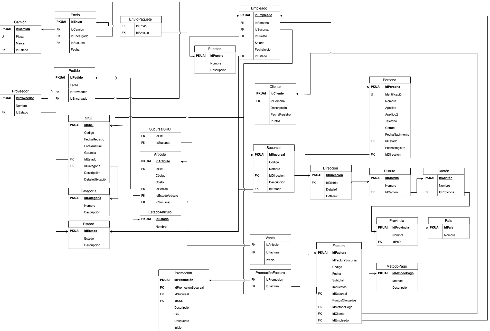

# Sk8-4-TEC
**sk8-4-TEC** is a proposal for an implementation of a database capable of handling most of the actors and elements that take place within a skate store. It models a centralized warehouse and a variable number of stores (branches), all of which contain their own database.
Aside from the sql file that defines the database creation, for the warehouse and branches, the project contains a python *wrapper*, that could be then connected to a GUI. Since some of the elements in the stores and warehouse are tightly related, the insertion of these elements must be done through the functions provided by the wrapper.

The diagrams below were generated using JetBrains tool *Datagrip* and its main purpose is to check whether the creation of the databases were done correctly or not.

- warehouse diagram:

- branch diagram:

